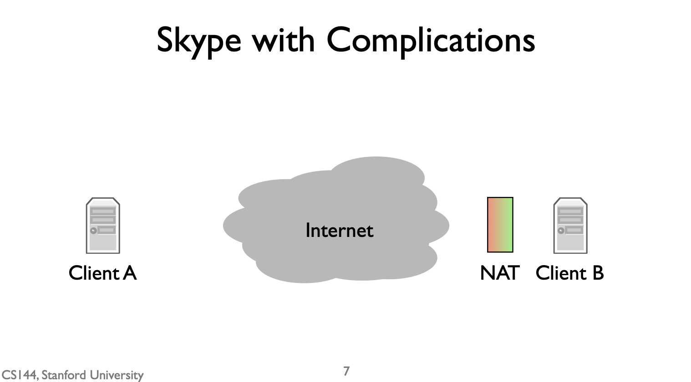
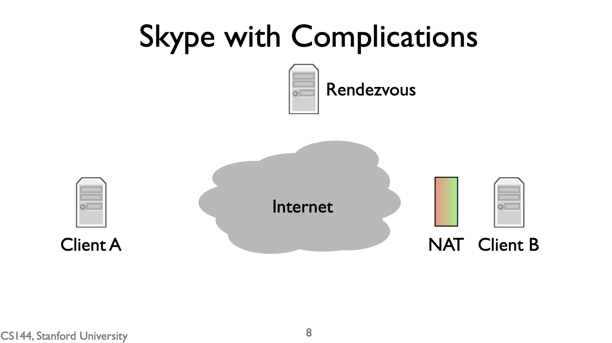
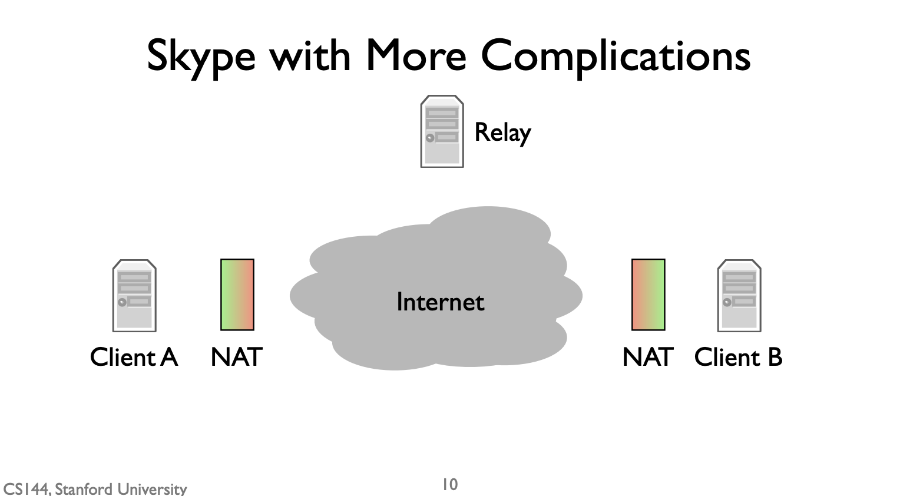

# 可靠字节流模型和三个应用

## 计算机网络的基石：可靠字节流模型 

其中最常用的模型是**双向可靠字节流**（bidirectional, reliable byte stream）

将计算机网络抽象成两个程序间read/write的管道（pipe）。

## 基于可靠字节流模型的三个应用

### World Wide Web（HTTP） 

> 超文本传输协议（英语：HyperText Transfer Protocol，缩写：HTTP）是一种用于分布式、协作式和超媒体信息系统的应用层协议[1]。HTTP是万维网的数据通信的基础。

* `client`和`server`
* `client`通过向连接写数据来**发送request**（write），`server`读数据来接收到请求（read），解析，写response到请求（write），最后`client`**读到response**(read)。
* 常见的请求有`GET`, `POST`, `DELETE`, `INFO`
* 常见面试题：`GET`和`POST`有什么区别? 

### BitTorrent 

> BitTorrent协议（简称BT，俗称比特洪流、BT下载）是用在对等网络中文件分享的网络协议程序。和点对点（point-to-point）的协议程序不同，它是用户群对用户群（peer-to-peer），而且用户越多，下载同一文件的人越多，下载该文件的速度越快。且下载后，继续维持上传的状态，就可以“分享”，成为其用户端节点下载的种子文件（.torrent），同时上传及下载。

* `Client`和`Tracker`
* `BitTorrent`使用的机制与`万维网`完全相同：`双向可靠字节流`。但它使用的是一种稍微更复杂的方式，即它是**用户群对用户群（peer-to-peer）**。很常见的p2p下载器，就是这种。

### Skype 

> Skype是一款通信应用软件，可通过互联网为电脑、平板电脑和移动设备提供与其他联网设备或传统电话/智能手机间进行视频通话和语音通话的服务。用户也可通过Skype收发即时通讯信息，传输文件，收发多媒体信息，进行视象会议。 

* 有些像`万维网`：一方打开连接到另一方，然后交换数据。
* 区别是，`万维网`是`client`和`server`连接，而Skype是两台`client`连接。这样会有些复杂，因位现在的个人电脑都连接在NAT后。

#### NAT 

> 网络地址转换器, 可以简单理解为路由器。

 

带NAT的用户可以主动发出连接，但无法接受连接。也就是上图的绿色到红色可以，红色到绿色不行。所以`万维网`那种点对点方式在这里不适用。 

 

Skype推出了一种解决方案: 使用`rendezvous server`。 带NAT的`client B`会与`rendezvous server`主动连接。
* 当`A`呼叫客户端B时，它向`rendezvous server`发送一条消息。由于有一个与`B`的开放连接，它告诉`B`有一个来自`A`的呼叫请求。如果`B`接受呼叫，`B`就会打开一个与客户端`A`的连接。由于`A`不在NAT后面，这个连接可以正常打开。这被称为`反向连接`(a reverse connection)。因为预期是A要主动连接B，结果是B主动连接的A。有点像小学时候你妈给你打电话，她无法直接打给你，因为你和班主任建立了连接，所以打给你班主任，你再给她打回去。

#### 两个客户端都有NAT

 

Skype推出了另一种解决方案: 使用中转站`relay`。 带NAT的`A`和`B`都与中转站建立连接，然后中转站通过这两个连接发送对方的数据。

## 总结 

综上所述，我们已经看到了网络应用最常见的通信模型：一个可靠的、双向的字节流。这允许两个运行在不同计算机上的程序在不同的计算机上运行来交换数据。它将整个网络抽象为一种简单的读/写关系。 

虽然这是一个非常简单的通信模型，但它可以被用于非常有创造性的复杂方式。我们看了三个例子：万维网、BitTorrent和Skype。

* 万维网是一种客户端-服务器模式。客户端打开与服务器的连接并要求提供文件。服务器会回应这些文件。

* BitTorrent是一种点对点模式，成群结队的客户互相打开连接，交换数据，形成一个密集的网络的连接。

* Skype是这两者的混合体。当Skype客户端可以直接通信时，他们以点对点的方式进行。但有时客户端不能直接打开连接，因此要通过会合点或中继服务器。

因此，你可以看到一个看起来非常简单的抽象，一个双向的、可靠的数据流，是如何被用于许多有趣的方式的。通过改变程序打开连接的方式和不同的程序所做的事情，我们可以创建复杂的应用程序，从文件检索到蜂群下载到IP电话。 

互联网是不断发展的。谁知道下一个新的惊人的应用会是什么？虽然它可能有一个不同于这三种应用的通信模式，但它几乎肯定会使用`双向可靠字节流`。

